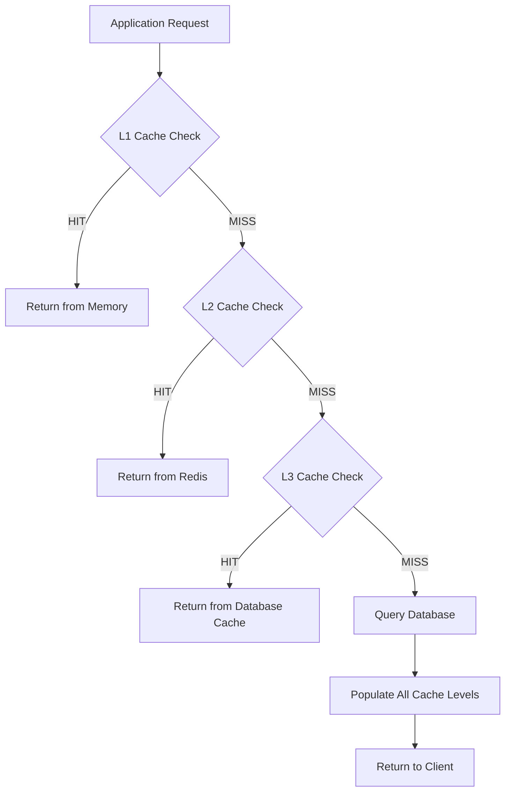

# Intelligent Caching System Guide

## Overview

The Intelligent Caching System is a cornerstone of our Phase 2 architecture, providing multi-level caching with automatic invalidation, performance optimization, and intelligent cache management. This system dramatically improves application performance by reducing database load and providing faster data access patterns.

## Architecture Overview

### Multi-Level Cache Hierarchy

Our caching system implements a sophisticated three-level cache hierarchy:



#### Level 1: In-Memory Cache

- **Storage**: Node.js application memory (Map-based)
- **Speed**: Ultra-fast (< 1ms access time)
- **Scope**: Single process/instance
- **Capacity**: Limited by available RAM
- **TTL**: Short-lived (30 seconds - 5 minutes)

#### Level 2: Redis Distributed Cache

- **Storage**: Redis server
- **Speed**: Very fast (< 5ms access time)
- **Scope**: Cross-process, multi-instance
- **Capacity**: Configurable, typically GBs
- **TTL**: Medium-lived (5 minutes - 1 hour)

#### Level 3: Database Query Cache

- **Storage**: Optimized read replicas, materialized views
- **Speed**: Fast (< 50ms access time)
- **Scope**: Global, persistent
- **Capacity**: Large, disk-based
- **TTL**: Long-lived (1 hour - 24 hours)

## Core Implementation

### Intelligent Cache Manager

**Location**: `apps/api/src/cache/IntelligentCache.ts`

```typescript
export class IntelligentCache {
  private l1Cache = new Map<string, CacheEntry>();
  private l2Cache: RedisClient;
  private l3Cache: QueryCache;
  private metrics: CacheMetrics;

  constructor(redisClient: RedisClient, queryCache: QueryCache, options: CacheOptions = {}) {
    this.l2Cache = redisClient;
    this.l3Cache = queryCache;
    this.metrics = new CacheMetrics();

    this.setupCleanupInterval();
    this.setupMetricsCollection();
  }

  async get<T>(
    key: string,
    fetcher?: () => Promise<T>,
    options: CacheGetOptions = {}
  ): Promise<T | null> {
    const startTime = Date.now();

    try {
      // Try L1 Cache (In-Memory)
      const l1Result = await this.getFromL1<T>(key);
      if (l1Result !== null) {
        this.metrics.recordHit("L1", Date.now() - startTime);
        return l1Result;
      }

      // Try L2 Cache (Redis)
      const l2Result = await this.getFromL2<T>(key);
      if (l2Result !== null) {
        // Populate L1 cache
        await this.setL1(key, l2Result, options.l1TTL);
        this.metrics.recordHit("L2", Date.now() - startTime);
        return l2Result;
      }

      // Try L3 Cache (Database)
      const l3Result = await this.getFromL3<T>(key);
      if (l3Result !== null) {
        // Populate L2 and L1 caches
        await this.setL2(key, l3Result, options.l2TTL);
        await this.setL1(key, l3Result, options.l1TTL);
        this.metrics.recordHit("L3", Date.now() - startTime);
        return l3Result;
      }

      // Cache miss - use fetcher if provided
      if (fetcher) {
        const fetchedData = await fetcher();

        // Populate all cache levels
        await this.setAll(key, fetchedData, options);

        this.metrics.recordMiss(Date.now() - startTime);
        return fetchedData;
      }

      this.metrics.recordMiss(Date.now() - startTime);
      return null;
    } catch (error) {
      this.metrics.recordError();
      console.error("Cache get error:", error);

      // Fallback to fetcher on cache error
      if (fetcher) {
        return await fetcher();
      }

      throw error;
    }
  }

  async set<T>(key: string, value: T, options: CacheSetOptions = {}): Promise<void> {
    await this.setAll(key, value, options);
  }

  async invalidate(key: string): Promise<void> {
    await Promise.all([this.invalidateL1(key), this.invalidateL2(key), this.invalidateL3(key)]);
  }

  async invalidateByTags(tags: string[]): Promise<void> {
    const keys = await this.getKeysByTags(tags);
    await Promise.all(keys.map((key) => this.invalidate(key)));
  }

  async invalidatePattern(pattern: string): Promise<void> {
    const keys = await this.getKeysByPattern(pattern);
    await Promise.all(keys.map((key) => this.invalidate(key)));
  }
}
```

### Cache Entry Structure

```typescript
interface CacheEntry<T = any> {
  value: T;
  ttl: number;
  createdAt: Date;
  lastAccessed: Date;
  tags: string[];
  metadata: CacheMetadata;
}

interface CacheMetadata {
  version: number;
  contentType: string;
  size: number;
  compressionType?: string;
  dependencies: string[];
}
```

### Cache Options Configuration

```typescript
interface CacheGetOptions {
  l1TTL?: number; // L1 cache TTL in milliseconds
  l2TTL?: number; // L2 cache TTL in milliseconds
  l3TTL?: number; // L3 cache TTL in milliseconds
  tags?: string[]; // Cache tags for invalidation
  forceRefresh?: boolean; // Skip cache, force data fetch
  compressionThreshold?: number; // Compress if data > threshold
}

interface CacheSetOptions extends CacheGetOptions {
  priority?: "LOW" | "NORMAL" | "HIGH"; // Cache priority
  serialize?: boolean; // Custom serialization
  dependencies?: string[]; // Cache dependencies
}
```

## Smart Invalidation System

### Event-Driven Invalidation

**Location**: `apps/api/src/cache/CacheIntegration.ts`

The cache system automatically invalidates related entries based on domain events:

```typescript
export class CacheInvalidationManager {
  private invalidationRules = new Map<string, InvalidationRule[]>();

  constructor(
    private cache: IntelligentCache,
    private eventBus: EventBus,
    private logger: Logger
  ) {
    this.setupEventHandlers();
    this.registerInvalidationRules();
  }

  private setupEventHandlers(): void {
    // Post-related invalidations
    this.eventBus.on("post.created", this.handlePostCreated.bind(this));
    this.eventBus.on("post.updated", this.handlePostUpdated.bind(this));
    this.eventBus.on("post.deleted", this.handlePostDeleted.bind(this));
    this.eventBus.on("post.published", this.handlePostPublished.bind(this));

    // Project-related invalidations
    this.eventBus.on("project.updated", this.handleProjectUpdated.bind(this));

    // User-related invalidations
    this.eventBus.on("user.updated", this.handleUserUpdated.bind(this));

    // Analytics invalidations
    this.eventBus.on("analytics.updated", this.handleAnalyticsUpdated.bind(this));
  }

  private async handlePostCreated(event: PostCreatedEvent): Promise<void> {
    const tags = [
      `project:${event.data.projectId}`,
      `user:${event.data.userId}`,
      "posts",
      "posts:list",
      "dashboard",
    ];

    await this.cache.invalidateByTags(tags);
    this.logger.info("Cache invalidated for post creation", {
      postId: event.aggregateId,
      tags,
    });
  }

  private async handlePostUpdated(event: PostUpdatedEvent): Promise<void> {
    const tags = [
      `post:${event.aggregateId}`,
      `project:${event.data.projectId}`,
      `user:${event.data.userId}`,
      "posts",
      "posts:list",
    ];

    // If status changed, invalidate dashboard
    if (event.data.statusChanged) {
      tags.push("dashboard", "analytics");
    }

    await this.cache.invalidateByTags(tags);
    this.logger.info("Cache invalidated for post update", {
      postId: event.aggregateId,
      tags,
    });
  }

  private async handlePostPublished(event: PostPublishedEvent): Promise<void> {
    const tags = [
      `post:${event.aggregateId}`,
      `project:${event.data.projectId}`,
      "published-posts",
      "dashboard",
      "analytics",
      "feed",
    ];

    // Invalidate channel-specific caches
    event.data.channelIds.forEach((channelId) => {
      tags.push(`channel:${channelId}`);
    });

    await this.cache.invalidateByTags(tags);
    this.logger.info("Cache invalidated for post publication", {
      postId: event.aggregateId,
      channelIds: event.data.channelIds,
      tags,
    });
  }
}
```

### Invalidation Rules Engine

```typescript
interface InvalidationRule {
  eventType: string;
  patterns: string[];
  tags: string[];
  conditions?: (event: DomainEvent) => boolean;
  delay?: number; // Delayed invalidation
}

export class InvalidationRulesEngine {
  private rules: InvalidationRule[] = [
    {
      eventType: "post.created",
      patterns: ["posts:*", "project:*:posts"],
      tags: ["posts", "dashboard"],
      conditions: (event) => event.data.status === "PUBLISHED",
    },
    {
      eventType: "analytics.updated",
      patterns: ["analytics:*"],
      tags: ["analytics", "dashboard", "reports"],
      delay: 5000, // Batch analytics updates
    },
    {
      eventType: "user.preferences.updated",
      patterns: ["user:*:preferences", "dashboard:*"],
      tags: ["user-preferences", "dashboard"],
    },
  ];

  async processEvent(event: DomainEvent): Promise<void> {
    const applicableRules = this.rules.filter(
      (rule) => rule.eventType === event.type && (!rule.conditions || rule.conditions(event))
    );

    for (const rule of applicableRules) {
      if (rule.delay) {
        // Delayed invalidation for batching
        setTimeout(() => {
          this.executeInvalidation(rule, event);
        }, rule.delay);
      } else {
        await this.executeInvalidation(rule, event);
      }
    }
  }

  private async executeInvalidation(rule: InvalidationRule, event: DomainEvent): Promise<void> {
    // Invalidate by patterns
    for (const pattern of rule.patterns) {
      const resolvedPattern = this.resolvePattern(pattern, event);
      await this.cache.invalidatePattern(resolvedPattern);
    }

    // Invalidate by tags
    if (rule.tags.length > 0) {
      await this.cache.invalidateByTags(rule.tags);
    }
  }

  private resolvePattern(pattern: string, event: DomainEvent): string {
    return pattern
      .replace("*", event.aggregateId)
      .replace("{userId}", event.data.userId)
      .replace("{projectId}", event.data.projectId);
  }
}
```

## Cache Warming Strategies

### Proactive Cache Warming

**Location**: `apps/api/src/cache/CacheWarmer.ts`

```typescript
export class CacheWarmer {
  constructor(
    private cache: IntelligentCache,
    private dataService: DataService,
    private scheduler: Scheduler,
    private logger: Logger
  ) {
    this.scheduleWarmupTasks();
  }

  private scheduleWarmupTasks(): void {
    // Warm critical data every 5 minutes
    this.scheduler.schedule("*/5 * * * *", () => {
      this.warmCriticalData();
    });

    // Warm user-specific data on login
    this.eventBus.on("user.logged-in", this.warmUserData.bind(this));

    // Warm project data when accessed
    this.eventBus.on("project.accessed", this.warmProjectData.bind(this));
  }

  private async warmCriticalData(): Promise<void> {
    const criticalQueries = [
      "dashboard:global-stats",
      "system:health",
      "providers:status",
      "popular:posts",
    ];

    await Promise.all(
      criticalQueries.map(async (query) => {
        try {
          await this.cache.get(query, () => this.dataService.getCriticalData(query), {
            l1TTL: 60000, // 1 minute
            l2TTL: 300000, // 5 minutes
            tags: ["critical", "system"],
          });
        } catch (error) {
          this.logger.warn("Failed to warm critical data", { query, error });
        }
      })
    );
  }

  private async warmUserData(event: UserLoggedInEvent): Promise<void> {
    const userId = event.data.userId;
    const warmupQueries = [
      `user:${userId}:profile`,
      `user:${userId}:projects`,
      `user:${userId}:recent-posts`,
      `user:${userId}:preferences`,
    ];

    // Warm user data in background
    setImmediate(async () => {
      await Promise.all(
        warmupQueries.map(async (query) => {
          try {
            await this.cache.get(query, () => this.dataService.getUserData(query, userId), {
              l1TTL: 120000, // 2 minutes
              l2TTL: 600000, // 10 minutes
              tags: [`user:${userId}`, "user-data"],
            });
          } catch (error) {
            this.logger.warn("Failed to warm user data", { userId, query, error });
          }
        })
      );
    });
  }

  private async warmProjectData(event: ProjectAccessedEvent): Promise<void> {
    const projectId = event.data.projectId;
    const userId = event.data.userId;

    const projectQueries = [
      `project:${projectId}:posts`,
      `project:${projectId}:channels`,
      `project:${projectId}:analytics`,
      `project:${projectId}:recent-activity`,
    ];

    // Predictive warming - load related data
    setImmediate(async () => {
      await Promise.all(
        projectQueries.map(async (query) => {
          try {
            await this.cache.get(
              query,
              () => this.dataService.getProjectData(query, projectId, userId),
              {
                l1TTL: 180000, // 3 minutes
                l2TTL: 900000, // 15 minutes
                tags: [`project:${projectId}`, `user:${userId}`, "project-data"],
              }
            );
          } catch (error) {
            this.logger.warn("Failed to warm project data", { projectId, query, error });
          }
        })
      );
    });
  }
}
```

## Performance Optimization

### Adaptive TTL Management

```typescript
export class AdaptiveTTLManager {
  private accessPatterns = new Map<string, AccessPattern>();

  constructor(private cache: IntelligentCache) {
    this.startPatternAnalysis();
  }

  calculateOptimalTTL(key: string, baseMetrics: CacheMetrics): number {
    const pattern = this.accessPatterns.get(key);

    if (!pattern) {
      return baseMetrics.defaultTTL;
    }

    const factors = {
      accessFrequency: this.getFrequencyFactor(pattern.accessFrequency),
      dataVolatility: this.getVolatilityFactor(pattern.updateFrequency),
      computationCost: this.getComputationFactor(pattern.fetchTime),
      memoryPressure: this.getMemoryPressureFactor(),
    };

    // Weighted calculation
    const optimizedTTL =
      baseMetrics.defaultTTL *
      (factors.accessFrequency * 0.3) *
      (factors.dataVolatility * 0.3) *
      (factors.computationCost * 0.2) *
      (factors.memoryPressure * 0.2);

    // Constrain within reasonable bounds
    return Math.max(baseMetrics.minTTL, Math.min(baseMetrics.maxTTL, optimizedTTL));
  }

  private getFrequencyFactor(frequency: number): number {
    // Higher frequency = longer TTL
    return Math.min(2.0, 1 + Math.log10(frequency + 1));
  }

  private getVolatilityFactor(updateFrequency: number): number {
    // Higher volatility = shorter TTL
    return Math.max(0.5, 1 - updateFrequency / 100);
  }

  private getComputationFactor(fetchTime: number): number {
    // Expensive operations = longer TTL
    return Math.min(2.0, 1 + fetchTime / 1000);
  }
}
```

### Cache Compression

```typescript
export class CacheCompression {
  private static readonly COMPRESSION_THRESHOLD = 1024; // 1KB

  static shouldCompress(data: any): boolean {
    const size = JSON.stringify(data).length;
    return size > this.COMPRESSION_THRESHOLD;
  }

  static async compress(data: any): Promise<CompressedData> {
    const jsonString = JSON.stringify(data);

    if (!this.shouldCompress(data)) {
      return {
        data: jsonString,
        compressed: false,
        originalSize: jsonString.length,
        compressedSize: jsonString.length,
      };
    }

    const compressed = await gzip(jsonString);

    return {
      data: compressed.toString("base64"),
      compressed: true,
      originalSize: jsonString.length,
      compressedSize: compressed.length,
      compressionRatio: compressed.length / jsonString.length,
    };
  }

  static async decompress(compressedData: CompressedData): Promise<any> {
    if (!compressedData.compressed) {
      return JSON.parse(compressedData.data);
    }

    const buffer = Buffer.from(compressedData.data, "base64");
    const decompressed = await gunzip(buffer);

    return JSON.parse(decompressed.toString());
  }
}
```

## Integration with CQRS

### Query Result Caching

```typescript
export class CachedQueryHandler<TQuery extends Query, TResult> {
  constructor(
    private innerHandler: QueryHandler<TQuery, TResult>,
    private cache: IntelligentCache,
    private cacheConfig: QueryCacheConfig
  ) {}

  async handle(query: TQuery): Promise<QueryResult<TResult>> {
    const cacheKey = this.generateCacheKey(query);

    const cachedResult = await this.cache.get<TResult>(
      cacheKey,
      async () => {
        const result = await this.innerHandler.handle(query);
        if (!result.success) {
          throw new Error(result.error);
        }
        return result.data!;
      },
      {
        l1TTL: this.cacheConfig.l1TTL,
        l2TTL: this.cacheConfig.l2TTL,
        l3TTL: this.cacheConfig.l3TTL,
        tags: this.generateCacheTags(query),
      }
    );

    return {
      success: true,
      data: cachedResult!,
      fromCache: true,
      metadata: {
        cacheKey,
        cached: true,
      },
    };
  }

  private generateCacheKey(query: TQuery): string {
    const keyParts = ["query", query.type, this.hashQueryData(query)];

    return keyParts.join(":");
  }

  private generateCacheTags(query: TQuery): string[] {
    const baseTags = ["queries", `query:${query.type}`];

    // Add entity-specific tags
    if ("projectId" in query) {
      baseTags.push(`project:${(query as any).projectId}`);
    }

    if ("userId" in query) {
      baseTags.push(`user:${(query as any).userId}`);
    }

    return baseTags;
  }

  private hashQueryData(query: TQuery): string {
    const queryData = { ...query };
    delete (queryData as any).type; // Remove type from hash

    return crypto
      .createHash("sha256")
      .update(JSON.stringify(queryData))
      .digest("hex")
      .substring(0, 16);
  }
}
```

## Monitoring and Analytics

### Cache Metrics Collection

```typescript
export class CacheMetrics {
  private metrics = {
    hits: new Map<string, number>(),
    misses: new Map<string, number>(),
    errors: new Map<string, number>(),
    latencies: new Map<string, number[]>(),
    sizes: new Map<string, number>(),
    evictions: new Map<string, number>(),
  };

  private prometheusMetrics = {
    cacheHits: new prometheus.Counter({
      name: "cache_hits_total",
      help: "Total cache hits",
      labelNames: ["level", "key_pattern"],
    }),

    cacheMisses: new prometheus.Counter({
      name: "cache_misses_total",
      help: "Total cache misses",
      labelNames: ["key_pattern"],
    }),

    cacheLatency: new prometheus.Histogram({
      name: "cache_operation_duration_seconds",
      help: "Cache operation latency",
      labelNames: ["operation", "level"],
      buckets: [0.001, 0.005, 0.01, 0.05, 0.1, 0.5, 1],
    }),

    cacheSize: new prometheus.Gauge({
      name: "cache_size_bytes",
      help: "Current cache size in bytes",
      labelNames: ["level"],
    }),

    hitRatio: new prometheus.Gauge({
      name: "cache_hit_ratio",
      help: "Cache hit ratio",
      labelNames: ["level", "time_window"],
    }),
  };

  recordHit(level: string, latency: number, keyPattern?: string): void {
    const pattern = keyPattern || "unknown";

    this.prometheusMetrics.cacheHits.labels(level, pattern).inc();
    this.prometheusMetrics.cacheLatency.labels("get", level).observe(latency / 1000);

    this.updateHitRatio(level);
  }

  recordMiss(latency: number, keyPattern?: string): void {
    const pattern = keyPattern || "unknown";

    this.prometheusMetrics.cacheMisses.labels(pattern).inc();
    this.prometheusMetrics.cacheLatency.labels("miss", "all").observe(latency / 1000);

    this.updateHitRatio("all");
  }

  recordError(level?: string, error?: string): void {
    const errorKey = level || "unknown";
    this.metrics.errors.set(errorKey, (this.metrics.errors.get(errorKey) || 0) + 1);
  }

  private updateHitRatio(level: string): void {
    const hits = this.prometheusMetrics.cacheHits.labels(level, "all");
    const misses = this.prometheusMetrics.cacheMisses.labels("all");

    // Calculate hit ratio for different time windows
    const ratios = this.calculateHitRatios(level);

    this.prometheusMetrics.hitRatio.labels(level, "1m").set(ratios.oneMinute);
    this.prometheusMetrics.hitRatio.labels(level, "5m").set(ratios.fiveMinute);
    this.prometheusMetrics.hitRatio.labels(level, "1h").set(ratios.oneHour);
  }

  getHealthReport(): CacheHealthReport {
    return {
      levels: {
        L1: this.getLevelHealth("L1"),
        L2: this.getLevelHealth("L2"),
        L3: this.getLevelHealth("L3"),
      },
      overall: this.getOverallHealth(),
      recommendations: this.generateRecommendations(),
    };
  }

  private getLevelHealth(level: string): LevelHealthReport {
    // Implementation for level-specific health metrics
    return {
      hitRatio: this.calculateHitRatio(level),
      averageLatency: this.calculateAverageLatency(level),
      errorRate: this.calculateErrorRate(level),
      memoryUsage: this.getMemoryUsage(level),
      status: this.determineStatus(level),
    };
  }

  private generateRecommendations(): CacheRecommendation[] {
    const recommendations: CacheRecommendation[] = [];

    // Analyze hit ratios
    if (this.calculateHitRatio("L1") < 0.8) {
      recommendations.push({
        type: "TTL_ADJUSTMENT",
        level: "L1",
        message: "Consider increasing L1 TTL for frequently accessed data",
        priority: "MEDIUM",
      });
    }

    // Analyze memory usage
    const l1Memory = this.getMemoryUsage("L1");
    if (l1Memory > 0.9) {
      recommendations.push({
        type: "MEMORY_PRESSURE",
        level: "L1",
        message: "L1 cache is approaching memory limits",
        priority: "HIGH",
      });
    }

    // Analyze error rates
    const errorRate = this.calculateErrorRate("L2");
    if (errorRate > 0.05) {
      recommendations.push({
        type: "ERROR_INVESTIGATION",
        level: "L2",
        message: "High error rate detected in L2 cache operations",
        priority: "HIGH",
      });
    }

    return recommendations;
  }
}
```

### Cache Dashboard

```typescript
// Cache dashboard endpoint
export const getCacheDashboard = async (fastify: FastifyInstance) => {
  fastify.route({
    method: "GET",
    url: "/api/cache/dashboard",
    preHandler: [authenticate, authorize(["cache:read"])],
    handler: async (request, reply) => {
      const metrics = await cacheManager.getMetrics();
      const health = await cacheManager.getHealthReport();
      const performance = await cacheManager.getPerformanceStats();

      reply.status(200).send({
        metrics: {
          hitRatios: {
            L1: metrics.L1.hitRatio,
            L2: metrics.L2.hitRatio,
            L3: metrics.L3.hitRatio,
            overall: metrics.overall.hitRatio,
          },
          latencies: {
            L1: metrics.L1.averageLatency,
            L2: metrics.L2.averageLatency,
            L3: metrics.L3.averageLatency,
          },
          sizes: {
            L1: metrics.L1.size,
            L2: metrics.L2.size,
            L3: metrics.L3.size,
          },
        },
        health: health,
        performance: performance,
        recommendations: health.recommendations,
        topKeys: await cacheManager.getTopKeys(),
        recentActivity: await cacheManager.getRecentActivity(),
      });
    },
  });
};
```

## Best Practices

### Cache Key Design

1. **Hierarchical Structure**: Use consistent naming patterns

   ```typescript
   // Good: Clear hierarchy
   const key = `user:${userId}:projects:${projectId}:posts`;

   // Bad: Flat structure
   const key = `${userId}_${projectId}_posts`;
   ```

2. **Versioning**: Include version information

   ```typescript
   const key = `v1:post:${postId}:analytics`;
   ```

3. **Environment Separation**: Prefix with environment
   ```typescript
   const key = `${process.env.NODE_ENV}:user:${userId}:profile`;
   ```

### TTL Strategy

1. **Data Volatility**: Set TTL based on how often data changes
2. **Access Patterns**: Longer TTL for frequently accessed data
3. **Business Requirements**: Consider business logic requirements
4. **Resource Constraints**: Balance TTL with memory/storage limits

### Tag Strategy

1. **Entity-Based**: Tag by primary entities (`user:123`, `project:456`)
2. **Feature-Based**: Tag by feature areas (`analytics`, `dashboard`)
3. **Hierarchical**: Use hierarchical tags (`posts:published`, `posts:draft`)
4. **Cross-Cutting**: Include cross-cutting concerns (`critical`, `public`)

### Error Handling

1. **Graceful Degradation**: Always provide fallback to source data
2. **Circuit Breaker**: Implement circuit breakers for cache failures
3. **Monitoring**: Comprehensive error tracking and alerting
4. **Recovery**: Automatic cache warming after failures

This intelligent caching system provides the foundation for high-performance, scalable applications while maintaining data consistency and providing excellent observability into cache behavior and performance.
