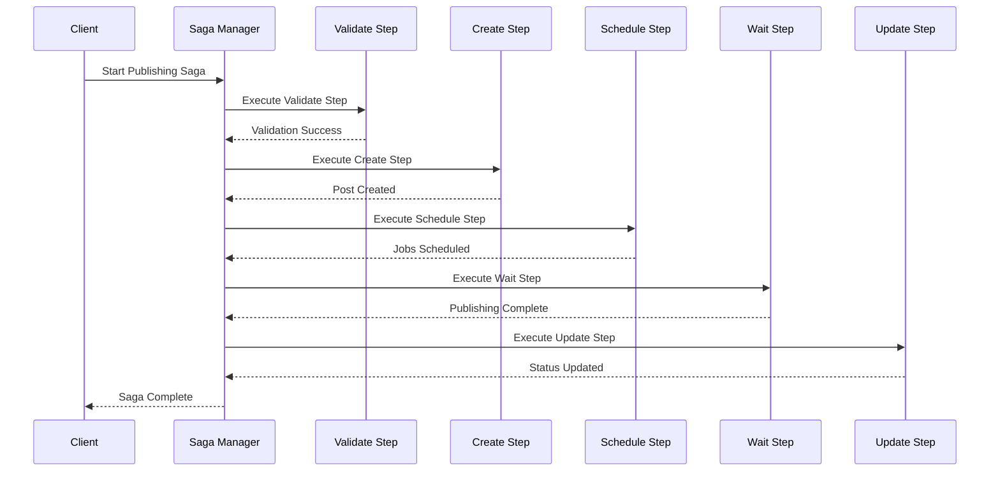

# Saga Orchestration Guide

## Overview

The Saga pattern is a crucial component of our Phase 2 architecture, providing reliable orchestration of complex business workflows across multiple aggregates and services. This guide details how saga orchestration is implemented and used throughout the system.

## Saga Pattern Fundamentals

### What is a Saga?

A Saga is a sequence of local transactions where each transaction updates data within a single service. If any transaction fails, the saga executes compensating actions to undo the impact of the preceding transactions.

### Key Benefits

1. **Distributed Transaction Management**: Manages complex workflows across multiple services
2. **Automatic Rollback**: Compensating actions ensure system consistency
3. **Fault Tolerance**: Built-in retry logic and error handling
4. **Auditability**: Complete workflow tracking and monitoring
5. **Scalability**: Asynchronous execution prevents blocking

## Core Architecture

### Saga Components

**Location**: `packages/shared/src/saga.ts`

#### 1. Saga Definition

Defines the workflow structure and configuration:

```typescript
interface SagaDefinition {
  id: string; // Unique identifier
  name: string; // Human-readable name
  version: string; // Version for compatibility
  steps: SagaStep[]; // Ordered sequence of steps
  timeout?: number; // Maximum execution time
  retryPolicy?: RetryPolicy; // Retry configuration
}
```

#### 2. Saga Instance

Runtime state of a saga execution:

```typescript
interface SagaInstance {
  id: string; // Unique instance ID
  definitionId: string; // Reference to definition
  status: SagaStatus; // Current execution status
  currentStep: number; // Current step index
  context: SagaContext; // Execution context
  stepResults: SagaStepResult[]; // Results from completed steps
  compensationResults: SagaStepResult[]; // Compensation results
  startedAt: Date; // Start timestamp
  completedAt?: Date; // Completion timestamp
  error?: string; // Error description if failed
  retryCount: number; // Current retry count
}
```

#### 3. Saga Step

Individual units of work within a saga:

```typescript
interface SagaStep<TData = unknown, TCompensationData = unknown> {
  id: string; // Step identifier
  name: string; // Human-readable name
  execute(context: SagaContext, data?: TData): Promise<SagaStepResult>;
  compensate?(context: SagaContext, compensationData?: TCompensationData): Promise<SagaStepResult>;
}
```

#### 4. Saga Context

Shared state across all steps:

```typescript
interface SagaContext {
  sagaId: string; // Saga instance ID
  correlationId: string; // Request correlation ID
  userId?: string; // Initiating user
  metadata: Record<string, unknown>; // Additional metadata
  stepData: Record<string, unknown>; // Data from previous steps
  events: DomainEvent[]; // Generated events
}
```

## Post Publishing Saga Workflow

### Workflow Overview

The Post Publishing Saga orchestrates the complete post publication process:



### Step-by-Step Implementation

#### Step 1: Validate Post Data

**Location**: `ValidatePostDataStep` class

```typescript
export class ValidatePostDataStep implements SagaStep {
  readonly id = "validate-post-data";
  readonly name = "Validate Post Data";

  async execute(context: SagaContext, data?: any): Promise<SagaStepResult> {
    try {
      const { postData } = data || {};

      // Validate required fields
      if (!postData?.body) {
        return {
          success: false,
          error: "Post body is required",
        };
      }

      if (!postData?.channelIds || postData.channelIds.length === 0) {
        return {
          success: false,
          error: "At least one channel must be selected",
        };
      }

      // Additional validation logic
      // - Character count limits
      // - Media validation
      // - Channel compatibility checks

      // Store validated data for next steps
      context.stepData[this.id] = {
        validatedData: postData,
        validatedAt: new Date(),
      };

      return {
        success: true,
        data: { validated: true },
      };
    } catch (error) {
      return {
        success: false,
        error: error instanceof Error ? error.message : "Validation failed",
      };
    }
  }

  // No compensation needed for validation
}
```

#### Step 2: Create Post Entity

**Location**: `CreatePostStep` class

```typescript
export class CreatePostStep implements SagaStep {
  readonly id = "create-post";
  readonly name = "Create Post";

  constructor(private executeCommand: (command: Command) => Promise<any>) {}

  async execute(context: SagaContext, data?: any): Promise<SagaStepResult> {
    try {
      // Get validated data from previous step
      const validationData = context.stepData["validate-post-data"] as any;
      const postData = validationData?.validatedData || data?.postData;

      // Create post via CQRS command
      const createCommand = {
        id: `cmd-create-post-${Date.now()}`,
        type: "post.create",
        aggregateId: data?.postId || `post-${Date.now()}`,
        aggregateType: "Post",
        data: postData,
        metadata: {
          userId: context.userId,
          correlationId: context.correlationId,
          source: "PostPublishingSaga",
        },
        timestamp: new Date(),
      };

      const result = await this.executeCommand(createCommand);

      if (!result.success) {
        return {
          success: false,
          error: result.error,
        };
      }

      // Store post information for subsequent steps
      context.stepData[this.id] = {
        postId: createCommand.aggregateId,
        version: result.data?.version || 1,
        createdAt: new Date(),
      };

      return {
        success: true,
        data: { postId: createCommand.aggregateId },
        compensationData: { postId: createCommand.aggregateId },
      };
    } catch (error) {
      return {
        success: false,
        error: error instanceof Error ? error.message : "Failed to create post",
      };
    }
  }

  // Compensation: Delete the created post
  async compensate(context: SagaContext, compensationData?: any): Promise<SagaStepResult> {
    try {
      const { postId } = compensationData || context.stepData[this.id];

      if (!postId) {
        return { success: true }; // Nothing to compensate
      }

      const deleteCommand = {
        id: `cmd-delete-post-${Date.now()}`,
        type: "post.delete",
        aggregateId: postId,
        aggregateType: "Post",
        data: { reason: "saga-compensation" },
        metadata: {
          userId: context.userId,
          correlationId: context.correlationId,
          source: "PostPublishingSaga:Compensation",
        },
        timestamp: new Date(),
      };

      await this.executeCommand(deleteCommand);

      return {
        success: true,
        data: { compensated: true, postId },
      };
    } catch (error) {
      return {
        success: false,
        error: error instanceof Error ? error.message : "Compensation failed",
      };
    }
  }
}
```

#### Step 3: Schedule Publishing Jobs

**Location**: `SchedulePublishingJobsStep` class

```typescript
export class SchedulePublishingJobsStep implements SagaStep {
  readonly id = "schedule-publishing-jobs";
  readonly name = "Schedule Publishing Jobs";

  constructor(private queueJob: (job: any) => Promise<string>) {}

  async execute(context: SagaContext, data?: any): Promise<SagaStepResult> {
    try {
      const createData = context.stepData["create-post"] as any;
      const postId = createData?.postId || data?.postId;

      if (!postId) {
        return {
          success: false,
          error: "Post ID not found from previous step",
        };
      }

      const validationData = context.stepData["validate-post-data"] as any;
      const { channelIds, scheduledAt } = validationData?.validatedData || data;

      const jobIds: string[] = [];

      // Create publishing job for each channel
      for (const channelId of channelIds) {
        const jobId = await this.queueJob({
          type: "publish-post",
          postId,
          channelId,
          scheduledAt: scheduledAt || new Date(),
          priority: data?.priority || "NORMAL",
          sagaId: context.sagaId,
          correlationId: context.correlationId,
        });

        jobIds.push(jobId);
      }

      context.stepData[this.id] = {
        jobIds,
        channelCount: channelIds.length,
        scheduledAt: scheduledAt || new Date(),
      };

      return {
        success: true,
        data: { jobIds, channelCount: channelIds.length },
        compensationData: { jobIds },
      };
    } catch (error) {
      return {
        success: false,
        error: error instanceof Error ? error.message : "Failed to schedule publishing jobs",
      };
    }
  }

  // Compensation: Cancel scheduled jobs
  async compensate(context: SagaContext, compensationData?: any): Promise<SagaStepResult> {
    try {
      const { jobIds } = compensationData || context.stepData[this.id];

      if (!jobIds || jobIds.length === 0) {
        return { success: true }; // Nothing to compensate
      }

      const cancelledJobs: string[] = [];
      for (const jobId of jobIds) {
        try {
          // Cancel the queued job (implementation depends on queue system)
          // await jobQueue.cancel(jobId);
          cancelledJobs.push(jobId);
        } catch (error) {
          console.warn(`Failed to cancel job ${jobId}:`, error);
        }
      }

      return {
        success: true,
        data: { cancelledJobs, cancelledCount: cancelledJobs.length },
      };
    } catch (error) {
      return {
        success: false,
        error: error instanceof Error ? error.message : "Job cancellation compensation failed",
      };
    }
  }
}
```

#### Step 4: Wait for Publishing Completion

**Location**: `WaitForPublishingCompletionStep` class

```typescript
export class WaitForPublishingCompletionStep implements SagaStep {
  readonly id = "wait-publishing-completion";
  readonly name = "Wait for Publishing Completion";

  constructor(
    private checkJobsStatus: (jobIds: string[]) => Promise<{
      completed: number;
      failed: number;
      pending: number;
    }>
  ) {}

  async execute(context: SagaContext): Promise<SagaStepResult> {
    try {
      const schedulingData = context.stepData["schedule-publishing-jobs"] as any;
      const { jobIds } = schedulingData;

      if (!jobIds || jobIds.length === 0) {
        return {
          success: false,
          error: "No jobs found from scheduling step",
        };
      }

      // Check status of all publishing jobs
      const status = await this.checkJobsStatus(jobIds);

      if (status.pending > 0) {
        // Still waiting for completion
        return {
          success: false,
          error: "Publishing jobs still in progress",
        };
      }

      context.stepData[this.id] = {
        totalJobs: jobIds.length,
        completed: status.completed,
        failed: status.failed,
        completedAt: new Date(),
      };

      if (status.failed > 0) {
        return {
          success: false,
          error: `${status.failed} out of ${jobIds.length} publishing jobs failed`,
        };
      }

      return {
        success: true,
        data: {
          publishingComplete: true,
          completedJobs: status.completed,
          totalJobs: jobIds.length,
        },
      };
    } catch (error) {
      return {
        success: false,
        error: error instanceof Error ? error.message : "Failed to check publishing status",
      };
    }
  }

  // No compensation needed for waiting
}
```

#### Step 5: Update Post Status

**Location**: `UpdatePostStatusStep` class

```typescript
export class UpdatePostStatusStep implements SagaStep {
  readonly id = "update-post-status";
  readonly name = "Update Post Status";

  constructor(private executeCommand: (command: Command) => Promise<any>) {}

  async execute(context: SagaContext, _data?: any): Promise<SagaStepResult> {
    try {
      const createData = context.stepData["create-post"] as any;
      const completionData = context.stepData["wait-publishing-completion"] as any;

      const postId = createData?.postId;
      const publishingSuccess = completionData?.publishingComplete;

      if (!postId) {
        return {
          success: false,
          error: "Post ID not found",
        };
      }

      const newStatus = publishingSuccess ? "PUBLISHED" : "FAILED";

      const updateCommand = {
        id: `cmd-update-post-status-${Date.now()}`,
        type: "post.update",
        aggregateId: postId,
        aggregateType: "Post",
        data: {
          status: newStatus,
          publishedAt: publishingSuccess ? new Date() : undefined,
        },
        metadata: {
          userId: context.userId,
          correlationId: context.correlationId,
          source: "PostPublishingSaga",
        },
        timestamp: new Date(),
      };

      const result = await this.executeCommand(updateCommand);

      if (!result.success) {
        return {
          success: false,
          error: result.error,
        };
      }

      context.stepData[this.id] = {
        previousStatus: "DRAFT",
        newStatus,
        updatedAt: new Date(),
      };

      return {
        success: true,
        data: { status: newStatus, postId },
        compensationData: { postId, previousStatus: "DRAFT", newStatus },
      };
    } catch (error) {
      return {
        success: false,
        error: error instanceof Error ? error.message : "Failed to update post status",
      };
    }
  }

  // Compensation: Revert status change
  async compensate(context: SagaContext, compensationData?: any): Promise<SagaStepResult> {
    try {
      const { postId, previousStatus } = compensationData || context.stepData[this.id];

      if (!postId || !previousStatus) {
        return { success: true }; // Nothing to compensate
      }

      const revertCommand = {
        id: `cmd-revert-post-status-${Date.now()}`,
        type: "post.update",
        aggregateId: postId,
        aggregateType: "Post",
        data: {
          status: previousStatus,
          publishedAt: null,
        },
        metadata: {
          userId: context.userId,
          correlationId: context.correlationId,
          source: "PostPublishingSaga:Compensation",
        },
        timestamp: new Date(),
      };

      await this.executeCommand(revertCommand);

      return {
        success: true,
        data: { revertedTo: previousStatus, postId },
      };
    } catch (error) {
      return {
        success: false,
        error: error instanceof Error ? error.message : "Status revert compensation failed",
      };
    }
  }
}
```

## Saga Manager Implementation

### Saga Execution Engine

**Location**: `apps/api/src/saga/SagaManager.ts`

```typescript
export class SagaManager implements SagaManager {
  private definitions = new Map<string, SagaDefinition>();
  private instances = new Map<string, SagaInstance>();

  constructor(
    private sagaRepository: SagaRepository,
    private eventPublisher: EventPublisher,
    private scheduler: SagaScheduler,
    private logger: Logger
  ) {}

  registerSaga(definition: SagaDefinition): void {
    this.definitions.set(definition.id, definition);
    this.logger.info("Saga definition registered", { definitionId: definition.id });
  }

  async startSaga(definitionId: string, context: Partial<SagaContext>): Promise<SagaInstance> {
    const definition = this.definitions.get(definitionId);
    if (!definition) {
      throw new Error(`Saga definition not found: ${definitionId}`);
    }

    const sagaId = createSagaId(definitionId);
    const sagaContext = createSagaContext(
      sagaId,
      context.correlationId || generateCorrelationId(),
      context.userId,
      context.metadata
    );

    const instance: SagaInstance = {
      id: sagaId,
      definitionId,
      status: "PENDING",
      currentStep: 0,
      context: sagaContext,
      stepResults: [],
      compensationResults: [],
      startedAt: new Date(),
      retryCount: 0,
    };

    // Persist saga instance
    await this.sagaRepository.save(instance);

    // Publish saga started event
    await this.eventPublisher.publish({
      id: generateEventId(),
      aggregateId: sagaId,
      aggregateType: "Saga",
      type: SAGA_EVENTS.SAGA_STARTED,
      data: {
        sagaId,
        definitionId,
        correlationId: sagaContext.correlationId,
        userId: sagaContext.userId,
        startedAt: instance.startedAt,
        totalSteps: definition.steps.length,
      },
      metadata: { source: "SagaManager" },
      version: 1,
      timestamp: new Date(),
    });

    // Start execution
    await this.continueSaga(sagaId);

    return instance;
  }

  async continueSaga(sagaId: string): Promise<SagaInstance> {
    const instance = await this.sagaRepository.findById(sagaId);
    if (!instance) {
      throw new Error(`Saga instance not found: ${sagaId}`);
    }

    const definition = this.definitions.get(instance.definitionId);
    if (!definition) {
      throw new Error(`Saga definition not found: ${instance.definitionId}`);
    }

    if (instance.status !== "PENDING" && instance.status !== "RUNNING") {
      return instance; // Already completed, failed, or compensating
    }

    instance.status = "RUNNING";

    try {
      while (instance.currentStep < definition.steps.length) {
        const step = definition.steps[instance.currentStep];
        const result = await this.executeStep(instance, step);

        instance.stepResults.push(result);

        if (result.success) {
          // Step succeeded, continue to next
          instance.currentStep++;
          await this.publishStepCompletedEvent(instance, step, result);
        } else {
          // Step failed, start compensation
          instance.status = "FAILED";
          await this.compensateSaga(sagaId);
          break;
        }
      }

      if (instance.currentStep >= definition.steps.length && instance.status === "RUNNING") {
        // All steps completed successfully
        instance.status = "COMPLETED";
        instance.completedAt = new Date();
        await this.publishSagaCompletedEvent(instance);
      }
    } catch (error) {
      this.logger.error("Saga execution error", { sagaId, error });
      instance.status = "FAILED";
      instance.error = error instanceof Error ? error.message : "Unknown error";
      await this.compensateSaga(sagaId);
    }

    // Persist updated instance
    await this.sagaRepository.save(instance);

    return instance;
  }

  private async executeStep(instance: SagaInstance, step: SagaStep): Promise<SagaStepResult> {
    try {
      this.logger.info("Executing saga step", {
        sagaId: instance.id,
        stepId: step.id,
        stepName: step.name,
      });

      const result = await step.execute(instance.context);

      this.logger.info("Saga step completed", {
        sagaId: instance.id,
        stepId: step.id,
        success: result.success,
        error: result.error,
      });

      return result;
    } catch (error) {
      this.logger.error("Saga step execution error", {
        sagaId: instance.id,
        stepId: step.id,
        error,
      });

      return {
        success: false,
        error: error instanceof Error ? error.message : "Step execution failed",
      };
    }
  }

  async compensateSaga(sagaId: string): Promise<SagaInstance> {
    const instance = await this.sagaRepository.findById(sagaId);
    if (!instance) {
      throw new Error(`Saga instance not found: ${sagaId}`);
    }

    const definition = this.definitions.get(instance.definitionId);
    if (!definition) {
      throw new Error(`Saga definition not found: ${instance.definitionId}`);
    }

    instance.status = "COMPENSATING";

    try {
      // Execute compensation in reverse order
      for (let i = instance.currentStep - 1; i >= 0; i--) {
        const step = definition.steps[i];
        const stepResult = instance.stepResults[i];

        if (step.compensate && stepResult.success) {
          const compensationResult = await step.compensate(
            instance.context,
            stepResult.compensationData
          );

          instance.compensationResults.unshift(compensationResult);

          if (!compensationResult.success) {
            this.logger.error("Compensation step failed", {
              sagaId: instance.id,
              stepId: step.id,
              error: compensationResult.error,
            });
          }
        }
      }

      instance.status = "COMPENSATED";
      instance.completedAt = new Date();
      await this.publishSagaCompletedEvent(instance);
    } catch (error) {
      this.logger.error("Saga compensation error", { sagaId, error });
      instance.status = "FAILED";
      instance.error = `Compensation failed: ${error instanceof Error ? error.message : "Unknown error"}`;
    }

    // Persist compensated instance
    await this.sagaRepository.save(instance);

    return instance;
  }
}
```

## Saga Integration with API

### Saga Route Handler

```typescript
// Start saga endpoint
export const startSagaRoute = async (fastify: FastifyInstance) => {
  fastify.route<{
    Body: {
      definitionId: string;
      context: Partial<SagaContext>;
      data?: unknown;
    };
    Reply: {
      sagaId: string;
      status: SagaStatus;
      startedAt: Date;
    };
  }>({
    method: "POST",
    url: "/api/sagas/start",
    schema: {
      body: {
        type: "object",
        required: ["definitionId", "context"],
        properties: {
          definitionId: { type: "string" },
          context: {
            type: "object",
            properties: {
              correlationId: { type: "string" },
              userId: { type: "string" },
              metadata: { type: "object" },
            },
          },
          data: {},
        },
      },
    },
    preHandler: [authenticate],
    handler: async (request, reply) => {
      try {
        const { definitionId, context, data } = request.body;

        // Add request data to context metadata
        const enrichedContext = {
          ...context,
          metadata: {
            ...context.metadata,
            requestData: data,
            requestId: request.id,
            userAgent: request.headers["user-agent"],
          },
        };

        const instance = await sagaManager.startSaga(definitionId, enrichedContext);

        reply.status(201).send({
          sagaId: instance.id,
          status: instance.status,
          startedAt: instance.startedAt,
        });
      } catch (error) {
        fastify.log.error("Start saga error", { error });
        reply.status(400).send({
          error: error instanceof Error ? error.message : "Failed to start saga",
        });
      }
    },
  });
};
```

### Saga Status Endpoint

```typescript
// Get saga status endpoint
export const getSagaStatusRoute = async (fastify: FastifyInstance) => {
  fastify.route<{
    Params: { sagaId: string };
    Reply: SagaInstance;
  }>({
    method: "GET",
    url: "/api/sagas/:sagaId",
    schema: {
      params: {
        type: "object",
        required: ["sagaId"],
        properties: {
          sagaId: { type: "string" },
        },
      },
    },
    preHandler: [authenticate],
    handler: async (request, reply) => {
      try {
        const { sagaId } = request.params;

        const instance = await sagaManager.getSaga(sagaId);
        if (!instance) {
          reply.status(404).send({ error: "Saga not found" });
          return;
        }

        // Filter sensitive information
        const sanitizedInstance = {
          ...instance,
          context: {
            sagaId: instance.context.sagaId,
            correlationId: instance.context.correlationId,
            // Remove sensitive metadata
            metadata: filterSensitiveData(instance.context.metadata),
          },
        };

        reply.status(200).send(sanitizedInstance);
      } catch (error) {
        fastify.log.error("Get saga status error", { error });
        reply.status(500).send({
          error: "Failed to get saga status",
        });
      }
    },
  });
};
```

## Event-Driven Saga Progression

### Event Handlers

Sagas can progress based on domain events:

```typescript
export class SagaEventHandler {
  constructor(
    private sagaManager: SagaManager,
    private logger: Logger
  ) {}

  @EventHandler("post.publishing.job.completed")
  async handlePublishingJobCompleted(event: PublishingJobCompletedEvent): Promise<void> {
    try {
      // Find saga instances waiting for this job
      const instances = await this.sagaRepository.findBySagaId(event.data.sagaId);

      for (const instance of instances) {
        if (instance.status === "RUNNING" && this.isWaitingForJob(instance, event.data.jobId)) {
          // Continue saga execution
          await this.sagaManager.continueSaga(instance.id);
        }
      }
    } catch (error) {
      this.logger.error("Saga event handler error", { event, error });
    }
  }

  @EventHandler("external.service.timeout")
  async handleExternalServiceTimeout(event: ExternalServiceTimeoutEvent): Promise<void> {
    // Handle timeouts that might affect saga execution
    const affectedSagas = await this.sagaRepository.findByCorrelationId(event.data.correlationId);

    for (const saga of affectedSagas) {
      if (saga.status === "RUNNING") {
        // Trigger compensation due to timeout
        await this.sagaManager.compensateSaga(saga.id);
      }
    }
  }
}
```

## Monitoring and Observability

### Saga Metrics

```typescript
// Saga execution metrics
const sagaExecutionDuration = new prometheus.Histogram({
  name: "saga_execution_duration_seconds",
  help: "Time spent executing sagas",
  labelNames: ["definition_id", "status"],
});

const sagaStepExecutionDuration = new prometheus.Histogram({
  name: "saga_step_execution_duration_seconds",
  help: "Time spent executing saga steps",
  labelNames: ["definition_id", "step_id", "status"],
});

const sagaCompensationRate = new prometheus.Gauge({
  name: "saga_compensation_rate",
  help: "Rate of saga compensations",
  labelNames: ["definition_id"],
});

const activeSagasGauge = new prometheus.Gauge({
  name: "active_sagas_total",
  help: "Number of currently active sagas",
  labelNames: ["definition_id", "status"],
});
```

### Saga Dashboard

Monitor saga execution through dedicated dashboard endpoints:

```typescript
// Saga dashboard endpoint
export const getSagaDashboard = async (fastify: FastifyInstance) => {
  fastify.route({
    method: "GET",
    url: "/api/sagas/dashboard",
    preHandler: [authenticate, authorize(["saga:read"])],
    handler: async (request, reply) => {
      const dashboard = await sagaRepository.getDashboardStats();

      reply.status(200).send({
        totalSagas: dashboard.total,
        activeSagas: dashboard.active,
        completedSagas: dashboard.completed,
        failedSagas: dashboard.failed,
        compensatedSagas: dashboard.compensated,
        averageExecutionTime: dashboard.averageExecutionTime,
        successRate: dashboard.successRate,
        stepPerformance: dashboard.stepPerformance,
        recentExecutions: dashboard.recentExecutions,
      });
    },
  });
};
```

## Testing Saga Workflows

### Unit Testing Saga Steps

```typescript
import { describe, it, beforeEach } from "node:test";
import assert from "node:assert/strict";

describe("CreatePostStep", () => {
  let step: CreatePostStep;
  let executedCommands: unknown[];

  beforeEach(() => {
    executedCommands = [];
    const mockCommandExecutor = async (cmd: unknown) => {
      executedCommands.push(cmd);
      return { success: true, data: { version: 1 } };
    };
    step = new CreatePostStep(mockCommandExecutor);
  });

  it("should create post successfully", async () => {
    const context = createMockSagaContext();
    const data = { postData: { title: "Test", content: "Content" } };

    const result = await step.execute(context, data);

    assert.ok(result.success, "Step should succeed");
    assert.ok(result.data?.postId, "Should return a postId");
    assert.strictEqual(executedCommands.length, 1);
  });

  it("should compensate by deleting post", async () => {
    const context = createMockSagaContext();
    const compensationData = { postId: "test-post-id" };

    const result = await step.compensate!(context, compensationData);

    assert.ok(result.success, "Compensation should succeed");
    assert.strictEqual(executedCommands.length, 1);
  });
});
```

### Integration Testing Full Saga

```typescript
describe("PostPublishingSaga Integration", () => {
  let sagaManager: SagaManager;
  let mockServices: MockedServices;

  beforeEach(async () => {
    mockServices = await setupMockServices();
    sagaManager = new SagaManager(
      mockServices.sagaRepository,
      mockServices.eventPublisher,
      mockServices.scheduler,
      mockServices.logger
    );

    // Register saga definition
    const sagaDefinition = createPostPublishingSagaDefinition(
      mockServices.commandExecutor,
      mockServices.jobQueue,
      mockServices.jobStatusChecker
    );

    sagaManager.registerSaga(sagaDefinition);
  });

  it("should complete post publishing workflow successfully", async () => {
    // Setup successful execution path
    mockServices.commandExecutor.mockResolvedValue({ success: true, data: { version: 1 } });
    mockServices.jobQueue.mockResolvedValue("job-123");
    mockServices.jobStatusChecker.mockResolvedValue({ completed: 1, failed: 0, pending: 0 });

    const context = {
      correlationId: "test-correlation",
      userId: "test-user",
      metadata: {
        postData: {
          title: "Test Post",
          content: "Test content",
          channelIds: ["channel-1"],
        },
      },
    };

    const instance = await sagaManager.startSaga("post-publishing-saga", context);

    // Wait for completion
    await waitForSagaCompletion(instance.id);

    const finalInstance = await sagaManager.getSaga(instance.id);
    expect(finalInstance?.status).toBe("COMPLETED");
    expect(finalInstance?.stepResults).toHaveLength(5);
    expect(finalInstance?.stepResults.every((r) => r.success)).toBe(true);
  });

  it("should compensate on failure", async () => {
    // Setup failure scenario
    mockServices.commandExecutor
      .mockResolvedValueOnce({ success: true, data: { version: 1 } }) // Create succeeds
      .mockRejectedValueOnce(new Error("Job scheduling failed")); // Scheduling fails

    const context = {
      correlationId: "test-correlation-failure",
      userId: "test-user",
      metadata: {
        postData: {
          title: "Failing Post",
          content: "Content",
          channelIds: ["channel-1"],
        },
      },
    };

    const instance = await sagaManager.startSaga("post-publishing-saga", context);

    await waitForSagaCompletion(instance.id);

    const finalInstance = await sagaManager.getSaga(instance.id);
    expect(finalInstance?.status).toBe("COMPENSATED");

    // Verify compensation was executed (post deleted)
    expect(mockServices.commandExecutor).toHaveBeenCalledWith(
      expect.objectContaining({
        type: "post.delete",
      })
    );
  });
});
```

## Best Practices

### Saga Design Principles

1. **Atomicity**: Each step should be atomic and idempotent
2. **Compensation**: Every step that can fail should have compensation logic
3. **Timeout Handling**: Set appropriate timeouts for each saga
4. **Error Recovery**: Implement retry logic for transient failures
5. **Monitoring**: Include comprehensive logging and metrics

### Performance Optimization

1. **Async Execution**: Use event-driven progression when possible
2. **Batch Operations**: Group related operations when feasible
3. **Resource Management**: Limit concurrent saga executions
4. **Cleanup**: Implement saga instance cleanup policies

### Security Considerations

1. **Data Sanitization**: Remove sensitive data from saga context
2. **Access Control**: Verify permissions before saga execution
3. **Audit Logging**: Log all saga activities for security audits
4. **Compensation Security**: Ensure compensation actions are authorized

This saga orchestration system provides reliable, scalable, and observable management of complex business workflows while maintaining data consistency and system reliability.
