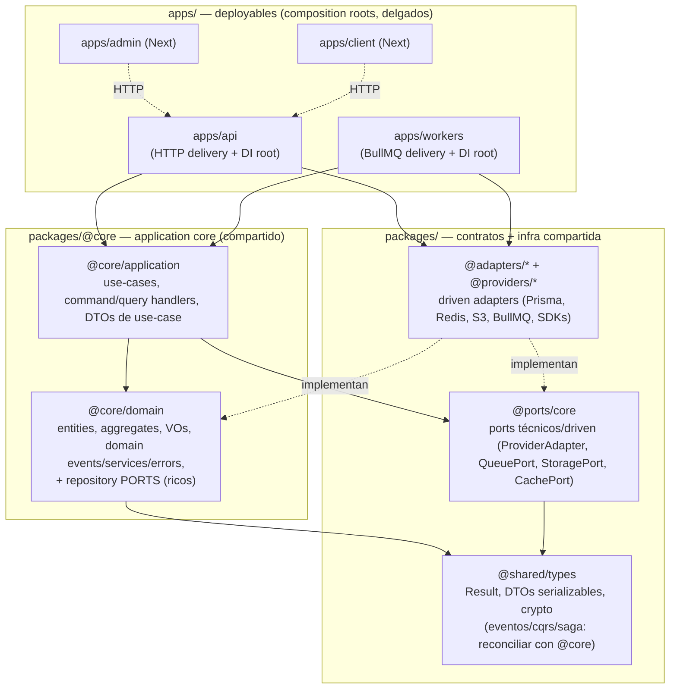

# Arquitectura objetivo (canon backend-flavored) — mapa de migración

> **Qué es esto:** el grafo de **dónde debería vivir cada parte del código** según el canon hexagonal/DDD
> backend, y el **orden incremental** (menor→mayor complejidad) para migrar hacia ahí. **La migración NO está
> ejecutada** — este doc es el mapa. Se ejecuta en fases dedicadas, con checkpoints de rollback.
>
> **Estado del repo hoy:** el maratón prisma→DI cerró (#21=0/#1=0); la duplicación worker↔use-case se resolvió
> (DUP-01/02, consumidores in-process). El gap arquitectónico restante: **el core de aplicación está atrapado en
> `apps/api`** y no es consumible por otros deployables (`apps/workers`, futuros). Este mapa lo corrige.

## 1. Principios canónicos + fuentes

| Principio                                                                                                                                                                                                                                                                                       | Fuente                         |
| ----------------------------------------------------------------------------------------------------------------------------------------------------------------------------------------------------------------------------------------------------------------------------------------------- | ------------------------------ |
| El **Application Core** = Application layer (use-cases + ports) + Domain layer (entities/VOs/eventos/servicios). Los **ports viven DENTRO del core**; los adapters afuera. Dependencias **hacia adentro**. Una sola implementación del core para **múltiples entry-points** (HTTP, queue, CLI). | Graça, "Explicit Architecture" |
| Capas concretas TS/Node: Domain (entities, aggregates, VOs, domain services/events/errors, **repository ports**); Application (use-cases, commands/queries/handlers); Interface (controllers/rutas, DTOs HTTP); Infrastructure (repo impls, adapters, ORM).                                     | Sairyss, domain-driven-hexagon |
| **Un composition root por ejecutable**, en el entry-point; el DI container no se filtra al core.                                                                                                                                                                                                | Seemann, "Composition Root"    |
| **Apps = contenedores de despliegue, no de código**; la lógica vive en libs/packages; boundaries **enforced** (no por convención).                                                                                                                                                              | Nx library-first               |

Fuentes (verificadas 2026-05): ver `canon_research_index.md` §"Hexagonal monorepo — distribución de código".

## 2. Grafo objetivo



**Lecturas del grafo:**

- Las **flechas sólidas = dependencia de compilación** (hacia adentro): apps → @core/application → @core/domain →
  @shared. El core **no** depende de apps ni de adapters.
- Los **adapters implementan ports** (línea punteada, inversión de control) y son **inyectados** por el composition
  root de cada app.
- Los **frontends (admin/client) NO consumen @core** — hablan con apps/api por HTTP.
- `apps/api` y `apps/workers` son **composition roots por ejecutable**: delgados, cablean el core + delivery.

### Árbol objetivo (resumido)

```text
packages/
  core/
    domain/        @core/domain      ← entities, aggregates, value-objects, events, errors,
                                        domain/services, repository PORTS (ricos), billing/analytics/ai/security puros
    application/   @core/application ← use-cases, command/query handlers, DTOs de contrato de use-case, UseCase base
  ports/           @ports/core       ← ProviderAdapter, QueuePort, StoragePort, CachePort, DLQ, SemanticLock (driven/técnicos)
  shared/          @shared/types     ← Result, DTOs serializables, channelCredentialsCrypto (UN solo hogar de eventos/errores)
  adapters/*                         ← Prisma repos (impl de los ports de dominio), Redis, S3, BullMQ, etc.
  providers/*                        ← SDKs por red social
apps/
  api/             composition root HTTP   ← rutas, middleware, infra/container, Zod DTOs HTTP, processors
  workers/         composition root BullMQ ← entry points de worker, wiring; resuelven use-cases de @core
  admin/ client/   frontends Next (no consumen @core)
```

## 3. Mapping: ubicación actual → destino canónico

| Categoría                                                         | Hoy                                                | Destino                                                          |
| ----------------------------------------------------------------- | -------------------------------------------------- | ---------------------------------------------------------------- |
| Entities, aggregates, VOs, domain events/services/errors          | `apps/api/src/domain/**` (puro)                    | **`@core/domain`**                                               |
| Repository **ports** ricos (ChannelRepository, etc.)              | `apps/api/src/domain/repositories/**`              | **`@core/domain`** (los ports van DENTRO del core)               |
| Use-cases + command/query handlers + UseCase base                 | `apps/api/src/application/**` (puro)               | **`@core/application`**                                          |
| DTOs de **contrato de use-case**                                  | `apps/api/src/application/**`                      | **`@core/application`**                                          |
| DTOs/schemas **HTTP (Zod request/response)**                      | `apps/api/src/**Routes.ts`                         | **se quedan en `apps/api`** (driving adapter)                    |
| Driving adapters: rutas HTTP, processors, queue consumers         | `apps/api/src/**`                                  | **se quedan en su app** (delgados)                               |
| Driven adapters: Prisma repo impls del dominio                    | `apps/api/src/infrastructure/repositories/Prisma*` | **`packages/adapters/*`** (consumibles por cualquier deployable) |
| Composition root / DI container                                   | `apps/api/src/infrastructure/container/**`         | **uno por ejecutable** (apps/api, apps/workers) — no se comparte |
| Ports técnicos/driven (ProviderAdapter, QueuePort…)               | `@ports/core`                                      | se quedan en `@ports/core`                                       |
| Result, crypto, DTOs serializables                                | `@shared/types`                                    | se quedan en `@shared/types`                                     |
| Islas ad-hoc `@core/engine` (planPublication) + `@core/threading` | `packages/core/{src,threading}`                    | **absorber** en `@core/domain` organizado                        |

## 4. Reconciliaciones que la migración debe resolver

- **Duplicación de eventos/errores:** `DomainEvent`/`EventDispatcher` existen en `apps/api/src/domain/events` **y** en
  `@shared/types/events`; `Result`/errores también viven en `@shared`. La migración elige **UN solo hogar**
  (`@core/domain` para el modelo de dominio; `@shared/types` para primitivos serializables) y borra el duplicado.
- **Islas `@core/*` ad-hoc:** `@core/engine`/`@core/threading` son extractos sueltos → absorber.
- **Dos abstracciones de repositorio en paralelo:** `@ports/core/RepoPort` (coarse, worker) vs los ports ricos de
  dominio. Definir cuál es canónico por caso (el rico va a `@core/domain`; `RepoPort` puede deprecarse o quedar como
  fachada).

## 5. Reglas de frontera (enforced, no por convención)

- `@core/domain` no importa **nada** (ni @core/application, ni adapters, ni apps). Solo `@shared/types`.
- `@core/application` importa **solo** `@core/domain` + `@ports/core` + `@shared/types`.
- `apps/*` pueden importar todo lo de packages; **nunca** de otra `app`.
- Adapters implementan ports; el core nunca importa un adapter.
- **Enforcement:** agregar `dependency-cruiser` (o `eslint-plugin-boundaries`) como gate CI que falle si una flecha va
  en dirección prohibida — "make the wrong thing hard" (Nx). Hoy las fitness functions cubren prisma/DI pero no la
  dirección @core↔apps.

## 6. Orden de migración (menor→mayor complejidad) — estrategia strangler

> Clave para no romper ~500 import-sites de golpe: **mover el archivo a `@core` + dejar un re-export shim** en la ruta
> vieja de `apps/api` (`export * from "@core/..."`). Los consumidores no se enteran; se migran sus imports por fases;
> el shim se borra al final. (Strangler Fig — Fowler.)

1. **Scaffold (trivial).** Crear `@core/domain` + `@core/application` (package.json + tsconfig + alias + project
   references) vacíos; añadir el gate de boundaries (dependency-cruiser) en modo warn.
2. **Kernel con shims (bajo-medio).** Mover los primitivos fundacionales a `@core/domain` con re-export shims en
   `apps/api/src/domain` (sin tocar consumidores aún): `EntityId`/`Entity`/`AggregateRoot`, `DomainError`,
   `DomainEvent` (reconciliando con `@shared`), `Repository.ts`/`UnitOfWork`. Blast-radius diferido por los shims.
3. **Contexto piloto (bajo).** Migrar el contexto más acotado y ya entendido — **analytics** o **inbox** (los que
   tocó B) — domain+application a `@core`, actualizar SUS imports, validar end-to-end (apps/api los resuelve igual).
4. **Resto de contextos, leaf-first (medio→alto).** Migrar contexto por contexto en orden de **acoplamiento
   ascendente**: primero los hoja (listening, trends, recurring, utm, links…), al final los centrales (posts,
   channels, billing). Cada uno: mover + actualizar imports del contexto + tests.
5. **Burn-down de shims (medio).** Migrar los import-sites restantes de las rutas viejas a `@core`; borrar los shims;
   flip del gate de boundaries a **hard error**.
6. **Cablear deployables a `@core` (bajo, el objetivo original).** `apps/workers` ya puede resolver use-cases de
   `@core`; decidir topología (mantener consumidores in-process en apps/api, o devolverlos a un worker aislado que
   resuelve de `@core`). Mover los driven adapters Prisma del dominio a `packages/adapters/*` donde haga falta.

Cada fase: gates (tsc 0, eslint 0/0, fitness, tests), commit propio, checkpoint de rollback.

## 7. Qué NO se mueve

- **apps/api / apps/workers** como capa de entrega: rutas, middleware, processors, queue consumers, composition root,
  Zod HTTP DTOs.
- **apps/admin / apps/client** (frontends Next): consumen la API por HTTP, no `@core`.
- **@shared/types** primitivos + **@ports/core** ports técnicos + **@adapters/@providers**.

## 8. Validación contra graphify (2026-05-24, commit `ff675659`)

Mapas regenerados (`graphify update .`) y revisados; corroboran este grafo **con números reales** (sin
contradicciones). graphify-out es gitignored/regenerable — acá queda la evidencia.

- **`apps/api` (14.963 nodos):** los **god-nodes son exactamente los primitivos del core** a extraer, y sus
  edge-counts son la prueba dura del blast-radius que justifica el orden kernel-first con shims (strangler):

  | God-node                                                       | edges | Destino                                        |
  | -------------------------------------------------------------- | ----- | ---------------------------------------------- |
  | `UseCaseError`                                                 | 413   | `@core/application`                            |
  | `UseCase`                                                      | 362   | `@core/application`                            |
  | `UnitOfWork`                                                   | 268   | `@core/domain`                                 |
  | `USE_CASE_ERRORS`                                              | 213   | `@core/application`                            |
  | `ProjectId`                                                    | 142   | `@core/domain` (VO)                            |
  | `EntityNotFoundError`                                          | 98    | `@core/domain`                                 |
  | `DomainError`                                                  | 80    | `@core/domain`                                 |
  | `BaseRouteHandler` (178), `TOKENS` (146), `RouteContext` (112) | —     | **se quedan en apps/api** (delivery + DI root) |

- **`apps/workers` (269 nodos):** `main()` arranca solo `startPublishWorker` + `startMentionIngestWorker`;
  `workerPrisma` es el composition root; `startAutoRenewalWorker → upsertAutoRenewalSchedule`. Confirma que B dejó
  workers = publish + mention sin los duplicados.

- **`packages` (4.915 nodos):** god-nodes `Ok` (123) / `Result` (109) = `@shared/types` (capa de primitivos);
  `@core/engine` (planPublication) y `@core/threading` (threadPlanner) son islas que dependen de `@shared` →
  absorber; comunidad `CommandResult/DomainEvent/SagaContext` = dominio viviendo en `@shared` → la duplicación a
  reconciliar.

- **Límite observado:** graphify (tree-sitter) marcó un nodo `getRepeatableJobs/removeRepeatableByKey` en workers que
  resultó un identificador en comentario JSDoc, no una llamada (el código usa `upsertJobScheduler`, fitness #20 = 0).
  El grafo es complemento de grep/read, no reemplazo.

---

_Insumo para la migración futura (workstream `@core`). Las decisiones abiertas (split por capa
`@core/{domain,application}` vs por bounded-context `@core/<context>`; deprecar `RepoPort`) se resuelven al arrancar
ese workstream, con este grafo como base._
